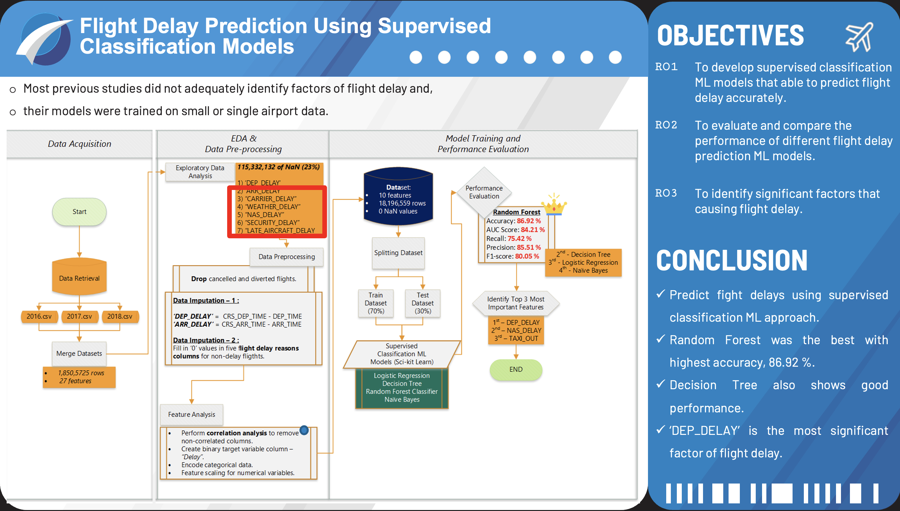

# Flight Delay Prediction Using Supervised Classification Model

## Introduction

There are various factors that can contribute to flight delays, including weather conditions, maintenance issues, and congestion at airports. For example, a study conducted by the Federal Aviation Administration found that in 2020 approximately 33.4% of flight delays were caused by weather-related issues, such as thunderstorms and high winds (United States Department of Transportation, 2022). The consequences of flight delays can be severe for both passengers and the aviation industry. Passengers may miss connections or important events, leading to additional expenses and disruptions to their travel plans. For airlines and airports, flight delays can result in lost revenue, as well as damage to their reputation and customer satisfaction (Efthymiou et al., 2018).

    Therefore, analysis of flight delay has become a popular research area. However, most of the previous studies did not focus on identifying main factors of flight delay. Besides, models in these studies were trained with data from single airport which is insufficient to predict flight delay in a long run. By training supervised classification machine learning models with long term flight data, the classifier model will be able to predict flight delay accurate and identify factors that usually cause delay. This helps airlines and airports can take proactive measures to minimize the impact of delays and improve the overall efficiency of the aviation system.

## Objectives

1) To develop supervised classification machine learning models that can predict delayed flight accurately.

2) To evaluate and compare the performance of different supervised classification models on predicting flight delays.

3) To identify significant factors that causing flight delay.

